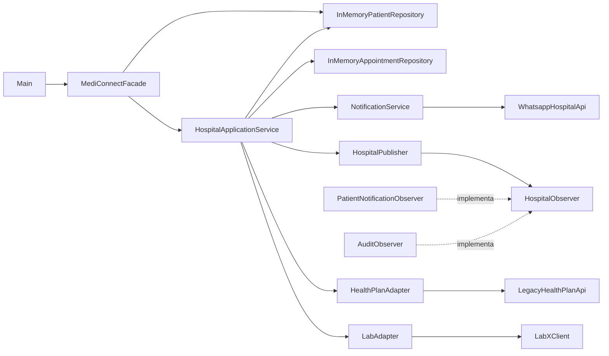

# Aula 05 — Componentes, conectores, configuração e modelagem

## Objetivo

Representar a estrutura atual do MediConnect por meio de seus principais componentes, das interações entre eles e da configuração utilizada pelo projeto, mantendo a modelagem coerente com o código existente.

## 1. Situação real identificada no projeto

O MediConnect concentra o fluxo principal do sistema no `HospitalApplicationService`. Esse serviço precisa consultar pacientes, salvar consultas, enviar notificações, publicar eventos e, no fluxo de exames, comunicar-se com sistemas externos de plano de saúde e laboratório.

Como existem várias classes participando do mesmo fluxo, a leitura isolada do código não deixa tão evidente quais componentes dependem uns dos outros e qual é a responsabilidade de cada parte. Isso aumenta a dificuldade para entender o impacto de futuras alterações, principalmente nas integrações externas e nas notificações.

### Problema/necessidade

É necessário registrar a arquitetura atual do MediConnect para deixar claro:

- quais são os componentes principais do sistema;
- qual responsabilidade pertence a cada componente;
- como os componentes se comunicam;
- quais integrações externas fazem parte do fluxo;
- qual configuração é necessária para compilar o projeto;
- onde cada elemento representado no diagrama existe no código.

A solução adotada nesta atividade é documentar a estrutura já existente, sem introduzir uma nova tecnologia ou alterar o comportamento do sistema apenas para adequá-lo ao diagrama.

## 2. Componentes principais e responsabilidades

| Componente | Responsabilidade no MediConnect |
| --- | --- |
| `Main` | Ponto de entrada utilizado para executar e demonstrar o fluxo principal da aplicação. |
| `MediConnectFacade` | Disponibiliza uma interface simplificada para cadastro de paciente, agendamento de consulta e solicitação de exame. |
| `HospitalApplicationService` | Coordena os casos de uso do hospital, como agendamento, solicitação de exame e internação. |
| `InMemoryPatientRepository` | Armazena e recupera pacientes em memória. |
| `InMemoryAppointmentRepository` | Armazena e recupera consultas/agendamentos em memória. |
| `NotificationService` | Centraliza o envio de notificações de consultas e exames pelos canais disponíveis. |
| `HealthPlanAdapter` | Adapta a autorização de procedimentos para a API legada do plano de saúde. |
| `LabAdapter` | Adapta a solicitação de exames para o cliente externo do laboratório. |
| `HospitalPublisher` | Publica eventos relacionados às operações do hospital para um observador inscrito. |
| `PatientNotificationObserver` | Implementa um observador responsável por reagir aos eventos do hospital com foco em notificação do paciente. |
| `AuditObserver` | Implementa um observador responsável por reagir aos eventos para fins de auditoria. |
| `LegacyHealthPlanApi` | Simula o sistema legado responsável pela autorização de procedimentos do plano de saúde. |
| `LabXClient` | Simula o sistema externo utilizado para encaminhar solicitações ao laboratório. |
| `WhatsappHospitalApi` | Simula a integração externa utilizada pelo serviço de notificação para envio via WhatsApp. |

## 3. Conectores e interações entre componentes

Os conectores do projeto são principalmente chamadas diretas de métodos Java entre objetos. Nas integrações externas, os adapters e o serviço de notificação fazem a ponte entre a aplicação e as classes que simulam sistemas legados.

| Origem | Destino | Conector/interação | Exemplo no fluxo |
| --- | --- | --- | --- |
| `Main` | `MediConnectFacade` | Chamada direta de métodos | `registerPatient()`, `schedule()` e `requestExam()` |
| `MediConnectFacade` | `HospitalApplicationService` | Chamada direta de métodos | Encaminha agendamento e solicitação de exame ao serviço de aplicação. |
| `MediConnectFacade` | `InMemoryPatientRepository` | Chamada direta de método | Salva o paciente por meio de `save()`. |
| `HospitalApplicationService` | `InMemoryPatientRepository` | Chamada direta de método | Consulta o paciente com `find()`. |
| `HospitalApplicationService` | `InMemoryAppointmentRepository` | Chamada direta de método | Persiste o agendamento com `save()`. |
| `HospitalApplicationService` | `NotificationService` | Chamada direta de métodos | Dispara notificações após agendamento e solicitação de exame. |
| `NotificationService` | `WhatsappHospitalApi` | Integração por chamada de método | Usa `sendMessage()` quando o canal escolhido é WhatsApp. |
| `HospitalApplicationService` | `HealthPlanAdapter` | Chamada por adapter | Solicita autorização do procedimento usando `authorize()`. |
| `HealthPlanAdapter` | `LegacyHealthPlanApi` | Adaptação de API legada | Converte o retorno de `authorizeProcedure()` em um resultado booleano. |
| `HospitalApplicationService` | `LabAdapter` | Chamada por adapter | Encaminha o exame autorizado usando `request()`. |
| `LabAdapter` | `LabXClient` | Adaptação de cliente externo | Converte o código de retorno de `sendExam()` em `boolean`. |
| `HospitalApplicationService` | `HospitalPublisher` | Publicação de evento | Usa `publish()` após alterações relevantes de estado. |
| `HospitalPublisher` | `HospitalObserver` | Observer/callback | Chama `update(id, evento)` no observador inscrito. |

## 4. Configuração relevante

A configuração de compilação está centralizada no arquivo `pom.xml`.

| Item | Configuração atual |
| --- | --- |
| Linguagem | Java |
| Versão de compilação | Java 17 |
| Ferramenta de build | Maven |
| `groupId` | `br.edu.mediconnect` |
| `artifactId` | `mediconnect` |
| Versão do projeto | `0.1.0-LEGADO` |
| Codificação | UTF-8 |
| Persistência | Em memória, com `HashMap` e `LinkedHashMap` |
| Integrações simuladas | Plano de saúde, laboratório e WhatsApp |

Trecho relevante do `pom.xml`:

```xml
<properties>
    <maven.compiler.source>17</maven.compiler.source>
    <maven.compiler.target>17</maven.compiler.target>
    <project.build.sourceEncoding>UTF-8</project.build.sourceEncoding>
</properties>
```

A montagem principal dos objetos acontece na `MediConnectFacade`, que cria os repositórios e fornece essas instâncias ao `HospitalApplicationService`:

```java
private final InMemoryPatientRepository patients = new InMemoryPatientRepository();
private final InMemoryAppointmentRepository appointments = new InMemoryAppointmentRepository();
private final HospitalApplicationService hospital =
        new HospitalApplicationService(patients, appointments);
```

Essa configuração faz com que o serviço e a fachada utilizem as mesmas instâncias dos repositórios durante a execução da aplicação.

## 5. Diagrama de componentes

O diagrama abaixo representa as dependências observadas no código atual.



### Leitura do diagrama

O `Main` acessa as funcionalidades do sistema pela `MediConnectFacade`. A fachada mantém os repositórios utilizados pela aplicação e delega os casos de uso ao `HospitalApplicationService`.

O `HospitalApplicationService` coordena o fluxo principal e utiliza os repositórios, o serviço de notificação, o publisher e os adapters. Os adapters isolam a forma de comunicação com as integrações de plano de saúde e laboratório. O `NotificationService` utiliza a integração de WhatsApp quando necessário, enquanto o `HospitalPublisher` comunica eventos por meio da interface `HospitalObserver`.

## 6. Relação entre elementos do diagrama e código

| Elemento do diagrama | Pacote/classe/arquivo |
| --- | --- |
| `Main` | `src/main/java/br/edu/mediconnect/Main.java` |
| `MediConnectFacade` | `src/main/java/br/edu/mediconnect/patterns/facade/MediConnectFacade.java` |
| `HospitalApplicationService` | `src/main/java/br/edu/mediconnect/service/HospitalApplicationService.java` |
| `InMemoryPatientRepository` | `src/main/java/br/edu/mediconnect/repository/InMemoryPatientRepository.java` |
| `InMemoryAppointmentRepository` | `src/main/java/br/edu/mediconnect/repository/InMemoryAppointmentRepository.java` |
| `NotificationService` | `src/main/java/br/edu/mediconnect/service/NotificationService.java` |
| `HealthPlanAdapter` | `src/main/java/br/edu/mediconnect/patterns/adapter/HealthPlanAdapter.java` |
| `LabAdapter` | `src/main/java/br/edu/mediconnect/patterns/adapter/LabAdapter.java` |
| `HospitalPublisher` | `src/main/java/br/edu/mediconnect/patterns/observer/HospitalPublisher.java` |
| `HospitalObserver` | `src/main/java/br/edu/mediconnect/patterns/observer/HospitalObserver.java` |
| `PatientNotificationObserver` | `src/main/java/br/edu/mediconnect/patterns/observer/PatientNotificationObserver.java` |
| `AuditObserver` | `src/main/java/br/edu/mediconnect/patterns/observer/AuditObserver.java` |
| `LegacyHealthPlanApi` | `src/main/java/br/edu/mediconnect/legacy/LegacyHealthPlanApi.java` |
| `LabXClient` | `src/main/java/br/edu/mediconnect/legacy/LabXClient.java` |
| `WhatsappHospitalApi` | `src/main/java/br/edu/mediconnect/legacy/WhatsappHospitalApi.java` |
| Configuração Maven/Java | `pom.xml` |

## 7. Verificação da atividade

Nesta atividade não foi necessário alterar o código-fonte para criar a modelagem. A documentação representa a estrutura que já existe no projeto.

A versão preparada para a entrega foi compilada com Java usando `--release 17`, compatível com a configuração do `pom.xml`. A classe principal e a classe `DiagnosticChecks` também foram executadas sem erro de compilação.

Resultado observado na execução da aplicação:

```text
Consulta A1: agendada com status SCHEDULED
Exame E1: autorizado e enviado ao laboratório com status SENT_TO_LAB
DiagnosticChecks: execução concluída
```

No ambiente de desenvolvimento do grupo, a verificação recomendada continua sendo:

```bash
mvn clean test
```

E a classe de diagnóstico pode ser executada com:

```bash
java -cp target/classes:target/test-classes br.edu.mediconnect.DiagnosticChecks
```

> Observação: em Windows, o separador do classpath é `;` em vez de `:`.

## 8. Evidência no GitHub

Para registrar a atividade no repositório, utilizar uma Issue, uma branch, um commit e uma Pull Request relacionados à Aula 05.

Sugestão de registro:

- **Issue:** `Aula 05 - Modelagem de componentes do MediConnect`
- **Branch:** `aula-05-componentes`
- **Commit:** `docs: adiciona modelagem de componentes da aula 05`
- **Pull Request:** `Aula 05 - Componentes, conectores e configuração`

Na descrição da Issue ou da Pull Request, registrar que a necessidade identificada foi documentar as responsabilidades e dependências dos componentes já existentes, sem introduzir tecnologia ou comportamento novo.

## Conclusão

A modelagem evidencia que o MediConnect está dividido entre fachada, serviço de aplicação, repositórios, notificações, publicação de eventos e integrações externas. O diagrama permite relacionar essas responsabilidades diretamente às classes e arquivos existentes, facilitando a compreensão da estrutura atual e servindo como referência para futuras mudanças no projeto.
