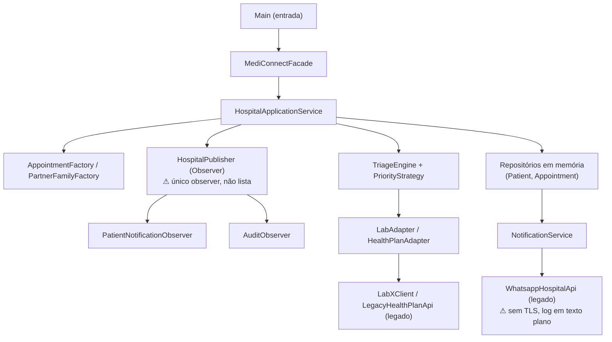
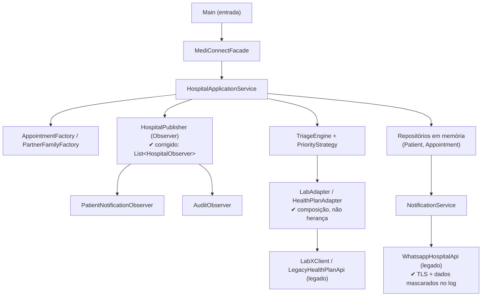

# Aula 06 — Atividade de Análise Arquitetural

## Objetivo

Analisar a arquitetura atual do projeto do grupo, relacionar requisitos funcionais e não funcionais às decisões arquiteturais e justificar tecnicamente a manutenção ou a evolução da arquitetura.

> **Importante:** 

---

## 1. Identificação

- **Projeto:** MediConnect — Sistema de Gestão Hospitalar (projeto acadêmico semestral)
- **Grupo:** MediConnect
- **Integrantes:** Ana Julia, João Gabriel, Rodrigo Yank
- **Data:** 05 de Setembro de 2026

---

## 2. Arquitetura atual

Consistente com `docs/adr/ADR-0001-arquitetura.md`, o MediConnect adota uma arquitetura em camadas simples, executada em processo único, com chamadas síncronas diretas entre os componentes.

### 2.1 Estrutura identificada

- **Entrada:** `Main` inicializa a fachada e dispara as primeiras chamadas.
- **Fachada:** `MediConnectFacade` concentra o acesso externo ao sistema (cadastro de paciente, agendamento, solicitação de exame).
- **Serviço de aplicação:** `HospitalApplicationService` orquestra agendamento de consultas, solicitação de exames e internação, chamando repositórios, padrões de apoio e adapters.
- **Repositórios em memória:** `InMemoryPatientRepository` e `InMemoryAppointmentRepository` persistem os dados durante a execução.
- **Padrões de criação:** `AppointmentFactory` cria consultas definindo prioridade por tipo de atendimento; `PartnerFamilyFactory` cria integrações com parceiros externos.
- **Padrão de estratégia:** `TriageEngine` + `PriorityStrategy` calculam a prioridade de atendimento de forma substituível.
- **Padrão de comportamento (Observer):** `HospitalPublisher` notifica observers (`PatientNotificationObserver`, `AuditObserver`) quando um evento de domínio ocorre.
- **Adapters para sistemas legados:** `LabAdapter` e `HealthPlanAdapter` isolam a comunicação com o laboratório (`LabXClient`) e a operadora de convênio (`LegacyHealthPlanApi`).
- **Notificações:** `NotificationService` encaminha mensagens por e-mail, SMS ou WhatsApp (`WhatsappHospitalApi`).

### 2.2 Evidências no projeto

- Evidência 1: `service/HospitalApplicationService.java` — método `schedule(Appointment a)` chama `patients.find(...)`, `appointments.save(...)`, `notifications.notify(...)` e `publisher.publish(...)` de forma síncrona, dentro do mesmo método.
- Evidência 2: `patterns/observer/HospitalPublisher.java` — guarda um único observer (`private HospitalObserver observer;`), não uma lista; `subscribe(o)` sobrescreve qualquer observer anterior.
- Evidência 3: `service/NotificationService.java` e `legacy/WhatsappHospitalApi.java` — imprimem telefone e texto do paciente em texto plano via `System.out`, sem criptografia.
- Evidência 4: `patterns/adapter/HealthPlanAdapter.java` — `extends LegacyHealthPlanApi` (herança direta da API legada, em vez de composição).
- Evidência 5: `README.md` — confirma execução com `mvn compile` e `java -cp target/classes br.edu.mediconnect.Main`, sem infraestrutura adicional.

### 2.3 Diagrama simplificado da arquitetura atual

---

## 3. Requisitos funcionais analisados

| ID | Requisito funcional | Evidência no projeto |
|---|---|---|
| RF01 | O sistema deve permitir agendar uma consulta vinculada a um paciente já cadastrado, definindo status inicial e prioridade conforme o tipo de atendimento (ex.: EMERGENCY, TELEMEDICINE). | `AppointmentFactory.create(...)` define a prioridade por tipo; `HospitalApplicationService.schedule(a)` valida o paciente, define `status="SCHEDULED"`, persiste e notifica. |
| RF02 | O sistema deve permitir solicitar um exame para um paciente, autorizando-o junto ao convênio antes de enviá-lo ao laboratório parceiro. | `HospitalApplicationService.requestExam(e, custo)` chama `HealthPlanAdapter.authorize(...)` e, se autorizado, `LabAdapter.request(...)`; o status final fica em `ExamRequest.status`. |

---

## 4. Requisitos não funcionais analisados

| ID | Requisito não funcional | Como pode ser verificado |
|---|---|---|
| RNF01 | Segurança: dados sensíveis do paciente (telefone, e-mail, autorização de convênio) não podem ser expostos em texto plano em logs; comunicação com parceiros externos deve ocorrer em canal criptografado (TLS). | Revisão de código/análise estática procurando PII em `System.out`; teste simulando canal sem TLS e esperando falha/bloqueio. |
| RNF02 | Desempenho: o fluxo de agendamento (`schedule`) deve responder em até 300ms sob carga normal, considerando que hoje todas as chamadas são síncronas e locais. | Teste de desempenho/benchmark sobre `HospitalApplicationService.schedule(...)`. |
| RNF03 | Confiabilidade/Disponibilidade: toda notificação relevante deve ser efetivamente entregue a todos os observers cadastrados (paciente e auditoria), e falha em um observer não pode interromper o fluxo de negócio principal. | Teste unitário registrando 2 observers e verificando que ambos recebem o evento; teste forçando exceção em um observer. |
| RNF04 | Manutenibilidade: a integração com cada parceiro externo deve ficar isolada em um adaptador dedicado, sem herança da API legada, permitindo trocar o parceiro sem alterar `HospitalApplicationService`. | Revisão de código/teste de contrato garantindo baixo acoplamento entre serviço e implementação legada. |

---

## 5. Relação RNF × parte da arquitetura

| RNF | Parte da arquitetura afetada | Justificativa |
|---|---|---|
| RNF01 | `NotificationService` + `legacy/WhatsappHospitalApi`; `patterns/adapter/*` | São os pontos onde dados do paciente saem do sistema para canais externos, hoje sem criptografia nem mascaramento — `NotificationService.notify(...)` imprime destinatário e texto via `System.out`. |
| RNF02 | `service/HospitalApplicationService.java` | O método `requestExam()` encadeia, na mesma thread, validação, autorização de convênio, envio ao laboratório, notificação e publicação de evento, tudo de forma síncrona. |
| RNF03 | `patterns/observer/HospitalPublisher.java` | A classe só mantém um campo `observer` (não uma lista); `HospitalApplicationService` registra `PatientNotificationObserver` e depois `AuditObserver` no construtor, e apenas o último permanece ativo. |
| RNF04 | `patterns/adapter/HealthPlanAdapter.java`; `patterns/abstractfactory/PartnerFamilyFactory.java` | `HealthPlanAdapter` estende diretamente a classe legada (herança) e expõe `legacyAuthorize()`; `PartnerFamilyFactory` devolve `Object` sem contrato comum. |

---

## 6. Problema arquitetural identificado

### Problema identificado

O `ADR-0001-arquitetura.md` já registrava, como consequência aceita da arquitetura em camadas, que falhas em integrações externas ou em observadores poderiam afetar o fluxo principal se não fossem tratadas com cuidado. Essa previsão se confirmou: `HospitalPublisher` guarda um único observer em vez de uma lista, então nem todo observer cadastrado é de fato notificado.

### Evidência

`patterns/observer/HospitalPublisher.java` — campo `private HospitalObserver observer;` e método `subscribe(HospitalObserver o){ observer = o; }`, que sobrescreve qualquer observer anterior. `HospitalApplicationService` registra `PatientNotificationObserver` e, em seguida, `AuditObserver` no construtor — apenas o segundo permanece ativo. Comportamento reproduzido em `src/test/java/br/edu/mediconnect/DiagnosticChecks.java`.

### Consequência possível

O paciente pode deixar de ser notificado sobre agendamentos, exames e internações, mesmo que o evento tenha sido processado e persistido com sucesso — um risco direto para o RNF03 (confiabilidade), silencioso porque o sistema não lança nenhum erro visível quando isso ocorre.

---

## 7. Alternativas arquiteturais

- **Alternativa A:** Manter a arquitetura atual em camadas simples, corrigindo o defeito do `HospitalPublisher` e reforçando segurança internamente.
- **Alternativa B:** Migrar para uma arquitetura orientada a eventos com message broker (fila/tópico), publicando e consumindo eventos de domínio (agendamento, exame, internação) de forma assíncrona.
- **Alternativa C:** Migrar para microsserviços por domínio (agendamento/exames, laboratório, convênio), comunicando-se via API.

---

## 8. Matriz de decisão arquitetural

A matriz completa (critérios, pesos, notas, cálculo `Peso × Nota` e totais) está no arquivo `MODELO-MATRIZ-DECISAO-preenchido.md`.

Resumo dos totais obtidos:

| Alternativa | Total |
|---|---:|
| A — Manter arquitetura atual | **49** |
| B — Arquitetura orientada a eventos | 36 |
| C — Microsserviços por domínio | 31 |

---

## 9. Justificativa das notas

As justificativas de cada nota atribuída na matriz (critério, alternativa, nota, motivo e evidência do projeto) estão detalhadas no arquivo `MODELO-JUSTIFICATIVAS-NOTAS-preenchido.md`.

---

## 10. Decisão arquitetural

### Alternativa escolhida ou mantida

**Alternativa A — manter a arquitetura em camadas simples**, confirmando a decisão já registrada em `ADR-0001-arquitetura.md`.

### Justificativa da decisão

A Alternativa A obteve a maior pontuação na matriz (49 contra 36 e 31), mas a escolha não se apoia só nisso: os problemas reais encontrados (bug de observer único e ausência de TLS/mascaramento de dados) são falhas de implementação, corrigíveis dentro do próprio estilo em camadas, e não limitações do estilo em si. Migrar para eventos ou microsserviços aumentaria a complexidade operacional e o custo de manutenção para uma equipe pequena e um prazo de semestre, sem que exista hoje um requisito real de escala que justifique esse investimento.

---

## 11. Trade-off

- **Ganho:** baixa complexidade operacional e baixo custo de manutenção — o sistema continua rodando com `mvn compile` e `java -cp target/classes`, sem infraestrutura adicional, compatível com o prazo do semestre.
- **Custo ou consequência:** o sistema segue sem reentrega automática de notificações em caso de falha (o que um broker de eventos ofereceria); a robustez depende inteiramente da implementação correta do publisher e dos observers.
- **Trade-off aceito pelo grupo:** o grupo aceita abrir mão, por ora, de uma entrega de notificações mais resiliente via fila em troca de simplicidade e previsibilidade de custo, já que não há hoje volume de uso que justifique a infraestrutura adicional. Em compensação, o grupo se compromete a corrigir os dois problemas concretos encontrados (observer único e falta de TLS/mascaramento) dentro da própria arquitetura atual.

---

## 12. Arquitetura proposta

A arquitetura é **mantida** em camadas simples. Os pontos destacados abaixo (✔) são as melhorias internas recomendadas — nenhuma delas muda o estilo arquitetural.

Pontos preservados: fachada única, serviço de aplicação central, repositórios em memória, uso dos padrões Factory/Strategy/Observer/Adapter. Pontos evoluídos internamente: lista de observers no `HospitalPublisher`, TLS/mascaramento de dados sensíveis em `NotificationService`/`WhatsappHospitalApi`, e composição (em vez de herança) em `HealthPlanAdapter`. Caso surjam requisitos reais de escala ou resiliência mais adiante, a migração para eventos ou microsserviços deverá ser reavaliada em um novo ADR.

---

## 13. Conclusão

Foi identificado que a arquitetura em camadas do MediConnect, já decidida em `ADR-0001-arquitetura.md`, apresenta dois problemas concretos de implementação: um defeito no padrão Observer (`HospitalPublisher` aceita apenas um observer) que compromete a confiabilidade das notificações, e a ausência de criptografia/mascaramento de dados sensíveis nas integrações externas. Três alternativas foram comparadas em matriz de decisão ponderada — manter a arquitetura atual, migrar para eventos ou migrar para microsserviços — e a primeira obteve a maior pontuação (49 contra 36 e 31), sustentada por menor complexidade operacional e custo, sem abrir mão da possibilidade de corrigir os problemas encontrados dentro do próprio estilo. A decisão tomada foi manter a arquitetura em camadas, aplicando três melhorias internas (lista de observers, TLS/mascaramento de logs, composição no adapter). Essa decisão é adequada ao projeto neste momento porque a equipe é pequena, o prazo é de um semestre e não há, hoje, requisito real de escala que justifique o custo e a complexidade de uma migração arquitetural.

