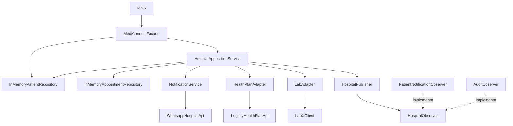
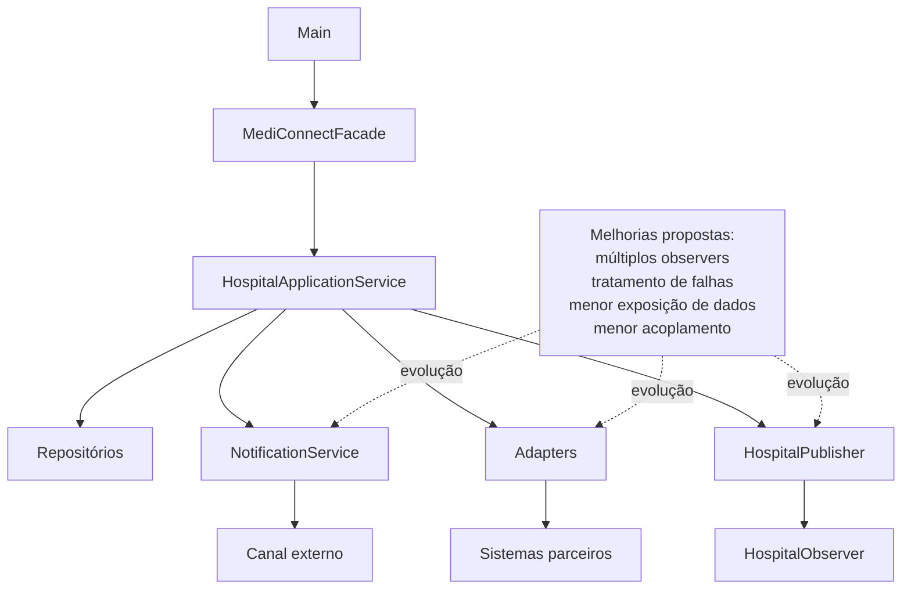

# Aula 06 — Análise Arquitetural do MediConnect

## Objetivo

Analisar a arquitetura atual do MediConnect, relacionar requisitos funcionais e não funcionais às decisões arquiteturais e comparar alternativas possíveis considerando benefícios, custos, riscos e trade-offs.

---

## 1. Identificação

- **Projeto:** MediConnect — Sistema de Gestão Hospitalar
- **Grupo:** MediConnect
- **Integrantes:** Ana Julia, João Gabriel e Rodrigo Yank
- **Data:** 05 de setembro de 2026

---

## 2. Arquitetura atual

Conforme registrado em `docs/adr/ADR-0001.md`, o MediConnect utiliza atualmente uma arquitetura em camadas simples, executada em processo único e com chamadas síncronas entre os componentes.

### 2.1 Estrutura identificada

Os principais elementos encontrados são:

- **Main:** ponto de entrada da aplicação.
- **MediConnectFacade:** fornece uma interface simplificada para acesso às funcionalidades principais.
- **HospitalApplicationService:** coordena os principais fluxos hospitalares.
- **Repositórios em memória:** armazenam pacientes e consultas durante a execução.
- **NotificationService:** concentra o envio das notificações.
- **HospitalPublisher:** publica eventos internos utilizando o padrão Observer.
- **Adapters:** isolam parte da integração com sistemas externos.
- **Factories e Strategies:** auxiliam na criação e priorização de objetos e atendimentos.

---

## 2.2 Evidências no código

### HospitalApplicationService

A classe `HospitalApplicationService` coordena diferentes operações.

No método `schedule(...)`, por exemplo, são realizadas as seguintes etapas:

1. busca do paciente;
2. alteração do status da consulta;
3. persistência da consulta;
4. envio de notificação;
5. publicação de evento.

Essas chamadas são realizadas de forma síncrona no mesmo fluxo.

### HospitalPublisher

O arquivo:

`src/main/java/br/edu/mediconnect/patterns/observer/HospitalPublisher.java`

possui atualmente:

```java
private HospitalObserver observer;
```

e:

```java
public void subscribe(HospitalObserver o) {
    observer = o;
}
```

Isso significa que apenas um observer é armazenado por vez.

Quando um novo observer é cadastrado, o anterior é substituído.

### NotificationService

O serviço de notificações utiliza `System.out` e a classe `WhatsappHospitalApi` para representar os canais de comunicação.

No estado atual, informações como e-mail, telefone e mensagens podem aparecer diretamente na saída do programa.

### HealthPlanAdapter

O `HealthPlanAdapter` possui dependência direta da implementação legada do convênio.

Isso aumenta o acoplamento entre o adapter e a API que deveria ser isolada.

---

## 2.3 Diagrama simplificado da arquitetura atual



O diagrama representa as dependências existentes no código atual.

---

## 3. Requisitos funcionais analisados

Foram selecionados dois requisitos funcionais relevantes para a análise arquitetural.

| ID | Requisito funcional | Evidência |
|---|---|---|
| RF01 | O sistema deve permitir agendar uma consulta para um paciente cadastrado. | `HospitalApplicationService.schedule(...)` valida o paciente, altera o status da consulta e salva o registro. |
| RF02 | O sistema deve permitir solicitar exames e verificar autorização do convênio antes do envio ao laboratório. | `HospitalApplicationService.requestExam(...)` utiliza `HealthPlanAdapter` e `LabAdapter`. |

---

## 4. Requisitos não funcionais analisados

Foram considerados quatro requisitos não funcionais relevantes.

| ID | Requisito não funcional | Forma de verificação |
|---|---|---|
| RNF01 | **Segurança:** informações sensíveis de pacientes não devem ser expostas indevidamente. | Revisão dos pontos onde e-mail, telefone e mensagens são enviados ou registrados. |
| RNF02 | **Desempenho:** os principais fluxos devem responder em tempo adequado para utilização do sistema. | Testes de desempenho sobre operações como `schedule(...)` e `requestExam(...)`. |
| RNF03 | **Confiabilidade/Disponibilidade:** eventos relevantes devem ser entregues corretamente aos componentes interessados sem comprometer o fluxo principal. | Testes envolvendo múltiplos observers e falhas durante a notificação. |
| RNF04 | **Manutenibilidade:** integrações externas devem permanecer isoladas para reduzir o acoplamento com sistemas legados. | Revisão das dependências existentes nos adapters. |

---

## 5. Relação entre RNFs e arquitetura

| RNF | Parte da arquitetura | Relação |
|---|---|---|
| RNF01 | `NotificationService` e integrações externas | São pontos em que informações do paciente são utilizadas fora do fluxo principal. |
| RNF02 | `HospitalApplicationService` | Concentra várias operações síncronas em um mesmo fluxo. |
| RNF03 | `HospitalPublisher` e observers | O publisher atualmente armazena apenas um observer por vez. |
| RNF04 | `HealthPlanAdapter` e `LabAdapter` | São responsáveis por isolar as integrações com sistemas externos. |

---

## 6. Problema identificado

Um problema concreto encontrado está relacionado ao padrão Observer.

Atualmente, `HospitalPublisher` possui apenas:

```java
private HospitalObserver observer;
```

O método:

```java
subscribe(...)
```

substitui o observer anteriormente registrado.

No construtor de `HospitalApplicationService`, são cadastrados:

```java
publisher.subscribe(new PatientNotificationObserver());
publisher.subscribe(new AuditObserver());
```

Como o segundo cadastro substitui o primeiro, apenas o último observer permanece registrado.

### Consequência

Um componente que deveria receber determinados eventos pode deixar de ser notificado.

Esse comportamento afeta diretamente o requisito:

**RNF03 — Confiabilidade/Disponibilidade.**

O problema já pode ser observado através do diagnóstico existente em:

`src/test/java/br/edu/mediconnect/DiagnosticChecks.java`

---

## 7. Alternativas arquiteturais

Foram analisadas três alternativas.

### Alternativa A — Manter a arquitetura atual

Manter a arquitetura em camadas simples e realizar melhorias internas nos pontos identificados.

Possíveis melhorias:

- permitir múltiplos observers;
- melhorar o tratamento de falhas;
- reduzir exposição de dados em logs;
- reduzir acoplamento das integrações legadas.

### Alternativa B — Arquitetura orientada a eventos

Utilizar um sistema de mensageria para publicação e consumo assíncrono de eventos.

Possíveis benefícios:

- desacoplamento;
- possibilidade de reprocessamento;
- maior isolamento entre produtores e consumidores.

Custos:

- necessidade de infraestrutura adicional;
- maior complexidade operacional;
- maior esforço de implementação.

### Alternativa C — Microsserviços

Separar partes do domínio em serviços independentes, por exemplo:

- agendamento;
- exames;
- convênio;
- laboratório.

Possíveis benefícios:

- isolamento entre domínios;
- possibilidade de evolução independente;
- escalabilidade por serviço.

Custos:

- maior complexidade;
- comunicação distribuída;
- múltiplos deploys;
- maior esforço de manutenção.

---

## 8. Matriz de decisão

A comparação detalhada entre as alternativas está registrada em:

`docs/Entrega_Aula6/MATRIZ-DECISAO.md`

Os resultados obtidos foram:

| Alternativa | Pontuação |
|---|---:|
| A — Manter arquitetura atual | **49** |
| B — Arquitetura orientada a eventos | 36 |
| C — Microsserviços | 31 |

As justificativas das notas estão registradas em:

`docs/Entrega_Aula6/JUSTIFICATIVAS-NOTAS.md`

---

## 9. Decisão arquitetural

A decisão foi **manter a arquitetura atual em camadas simples**, conforme já registrado em:

`docs/adr/ADR-0001.md`

A decisão considera não apenas a pontuação da matriz, mas também o contexto atual do projeto.

O MediConnect:

- possui equipe pequena;
- é um projeto acadêmico semestral;
- utiliza um único módulo Maven;
- não apresenta atualmente requisito comprovado de grande escala;
- não possui infraestrutura de mensageria ou microsserviços.

Os principais problemas encontrados podem ser tratados através de melhorias internas sem a necessidade de alterar o estilo arquitetural completo.

---

## 10. Trade-offs

### Benefícios da decisão

- menor complexidade operacional;
- menor esforço de manutenção;
- menor custo de evolução;
- arquitetura mais simples para a equipe atual;
- não exige nova infraestrutura.

### Custos e riscos

Manter uma arquitetura síncrona e executada em processo único significa que:

- falhas em integrações podem afetar o fluxo principal;
- não existe reentrega automática de eventos;
- a confiabilidade depende da implementação correta dos componentes;
- um aumento significativo de escala poderá exigir nova avaliação arquitetural.

### Trade-off aceito

O grupo aceita manter uma solução mais simples no momento, mesmo abrindo mão de recursos de resiliência e desacoplamento que poderiam ser oferecidos por mensageria ou microsserviços.

Essa decisão poderá ser revista caso o contexto do projeto mude.

---

## 11. Melhorias propostas

A decisão desta aula **não exige que as melhorias abaixo já estejam implementadas**.

Elas representam pontos de evolução identificados a partir da análise arquitetural.

### Observer

Evoluir o `HospitalPublisher` para permitir múltiplos observers em vez de manter apenas um.

### Segurança

Evitar exposição desnecessária de dados sensíveis em logs e definir mecanismos adequados de segurança quando as integrações externas forem reais.

### Adapters

Reduzir o acoplamento entre os adapters e as implementações legadas, utilizando contratos e composição quando adequado.

### Tratamento de falhas

Evitar que uma falha em notificações ou integrações secundárias interrompa operações principais do sistema.

---

## 12. Arquitetura mantida com melhorias propostas



Esse diagrama representa a manutenção do estilo arquitetural atual e os pontos que podem ser evoluídos posteriormente.

---

## 13. Validação

A atividade da Aula 06 é principalmente de análise e documentação arquitetural.

Não foi necessária uma migração arquitetural nem alteração obrigatória de código para cumprir a atividade.

Após os ajustes realizados anteriormente no projeto, a compilação e os testes foram verificados com:

```bash
mvn clean test
```

Resultado:

```text
Tests run: 2, Failures: 0, Errors: 0, Skipped: 0
BUILD SUCCESS
```

---

## 14. Conclusão

A análise mostrou que a arquitetura em camadas simples continua adequada ao contexto atual do MediConnect.

Foram identificados problemas concretos de implementação, principalmente no mecanismo de observers, além de pontos de atenção relacionados à segurança e ao acoplamento com sistemas externos.

Três alternativas arquiteturais foram comparadas: manutenção da arquitetura atual, arquitetura orientada a eventos e microsserviços.

Considerando requisitos, custos, riscos, complexidade e contexto do projeto, foi mantida a arquitetura atual.

As melhorias identificadas serão tratadas como evolução interna do sistema e não como uma migração arquitetural obrigatória.