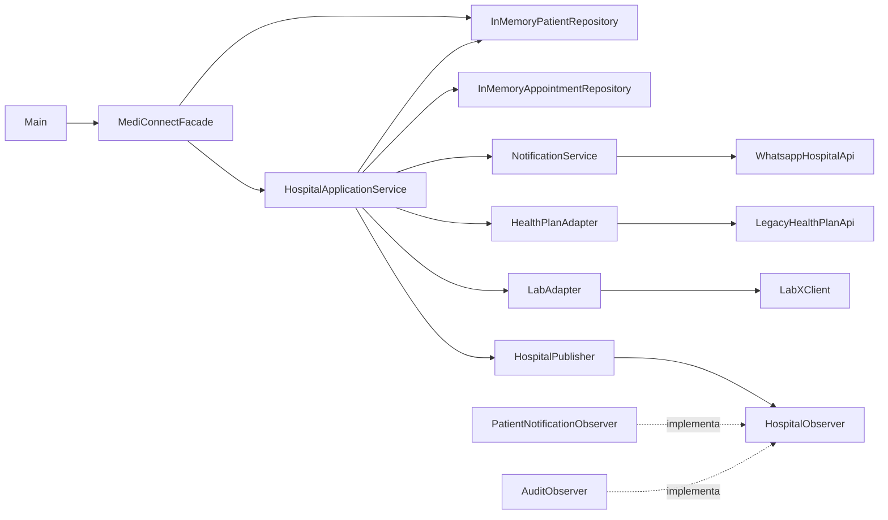

# ADR-0003 — Organização e documentação dos componentes do MediConnect

## Status

Aceito.

## Contexto

O MediConnect possui diferentes classes responsáveis pela coordenação dos processos hospitalares, armazenamento de dados, notificações, integrações externas e publicação de eventos.

Essas responsabilidades estão distribuídas entre elementos como:

- `MediConnectFacade`;
- `HospitalApplicationService`;
- repositórios em memória;
- `NotificationService`;
- adapters;
- publisher e observers.

Sem uma representação clara dessas relações, torna-se mais difícil compreender a estrutura atual do sistema, identificar as responsabilidades de cada componente e visualizar como eles interagem.

A necessidade desta atividade é documentar a estrutura existente sem modificar o comportamento do sistema apenas para adequá-lo a um modelo arquitetural.

## Decisão

A estrutura atual do MediConnect será documentada através da identificação dos seus principais componentes, conectores e configurações.

A `MediConnectFacade` será considerada o ponto de acesso às funcionalidades principais da aplicação.

A `HospitalApplicationService` continuará sendo representada como o componente responsável por coordenar os principais fluxos hospitalares e por interagir com:

- repositórios;
- serviço de notificações;
- adapters de integração;
- mecanismo de publicação de eventos.

As integrações externas continuarão sendo representadas através dos adapters e serviços existentes no projeto.

Não serão introduzidos novos componentes ou tecnologias apenas para atender à modelagem da atividade.

## Diagrama dos componentes

O diagrama representa as principais relações existentes no código.

O `Main` utiliza a `MediConnectFacade`, que fornece um ponto simplificado de acesso à aplicação.

A `HospitalApplicationService` coordena os principais processos hospitalares e utiliza os demais componentes necessários para realizar essas operações.

O `HospitalPublisher` depende do contrato definido por `HospitalObserver`, enquanto `PatientNotificationObserver` e `AuditObserver` são implementações desse contrato.

## Conectores

Os componentes se comunicam principalmente através de chamadas de métodos Java.

As principais interações são:

- `MediConnectFacade` → `HospitalApplicationService`;
- `HospitalApplicationService` → repositórios;
- `HospitalApplicationService` → `NotificationService`;
- `HospitalApplicationService` → `HealthPlanAdapter`;
- `HospitalApplicationService` → `LabAdapter`;
- `HospitalApplicationService` → `HospitalPublisher`;
- `HealthPlanAdapter` → `LegacyHealthPlanApi`;
- `LabAdapter` → `LabXClient`;
- `NotificationService` → `WhatsappHospitalApi`;
- `HospitalPublisher` → `HospitalObserver`.

## Configuração relevante

A configuração principal do projeto está registrada no arquivo `pom.xml`.

O projeto utiliza:

- Java 17 como versão de compilação;
- Maven como ferramenta de build;
- UTF-8 como codificação;
- JUnit 5 para testes automatizados;
- Maven Surefire Plugin para execução dos testes;
- estruturas em memória para persistência;
- classes que simulam sistemas externos para as integrações.

## Alternativas consideradas

### Reestruturar o sistema para coincidir com um modelo arquitetural novo

Essa alternativa permitiria alterar a organização atual antes de produzir o diagrama.

Foi descartada porque a atividade tem como objetivo identificar e representar os componentes já existentes.

Modificar o código apenas para produzir uma modelagem diferente aumentaria a quantidade de mudanças e poderia alterar o comportamento do projeto sem necessidade funcional.

### Documentar somente as classes principais

Essa alternativa produziria uma representação mais simples.

Foi descartada porque não demonstraria adequadamente os conectores, integrações externas e demais relações importantes para compreender o sistema.

## Consequências

### Positivas

- A estrutura do MediConnect passa a ficar documentada de forma mais clara.
- As responsabilidades dos principais componentes ficam mais fáceis de identificar.
- As dependências e integrações podem ser visualizadas através do diagrama.
- A documentação pode ser relacionada diretamente às classes existentes.
- A modelagem pode servir como referência para futuras alterações arquiteturais.

### Negativas / trade-offs

- O diagrama representa a estrutura atual e precisará ser atualizado quando o código mudar.
- A documentação também evidencia problemas já existentes na implementação, mas não os corrige automaticamente.
- Algumas classes concentram diversas interações, especialmente a `HospitalApplicationService`.

## Evidências relacionadas

- **Modelagem:** `docs/aula05-componentes-conectores.md`
- **Configuração:** `pom.xml`
- **Serviço principal:** `src/main/java/br/edu/mediconnect/service/HospitalApplicationService.java`
- **Fachada:** `src/main/java/br/edu/mediconnect/patterns/facade/MediConnectFacade.java`
- **Publisher:** `src/main/java/br/edu/mediconnect/patterns/observer/HospitalPublisher.java`
- **Verificação:** `evidencias/AULA-05-VERIFICACAO.md`