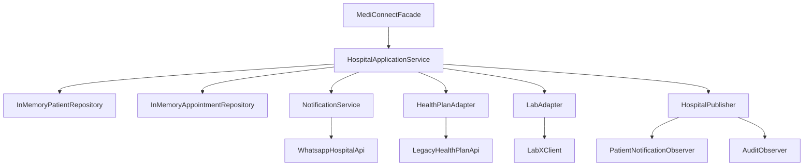

# ADR-0003 — Organização e documentação dos componentes do MediConnect

## Status

Aceito.

## Contexto

O MediConnect possui diferentes componentes responsáveis pela coordenação dos processos hospitalares, armazenamento de dados, notificações e integração com sistemas externos. Essas responsabilidades estão distribuídas entre classes como `MediConnectFacade`, `HospitalApplicationService`, repositórios em memória, serviços de notificação, adapters e observadores.

Sem uma representação clara dessas ligações, fica mais difícil compreender a estrutura do sistema e identificar como os componentes dependem e interagem entre si.

## Decisão

A estrutura atual do MediConnect será documentada considerando seus principais componentes, suas responsabilidades, conectores e configurações existentes.

A `MediConnectFacade` será considerada o ponto de acesso às funcionalidades principais, enquanto a `HospitalApplicationService` continuará responsável por coordenar os fluxos da aplicação e interagir com repositórios, serviços, adapters e o mecanismo de publicação de eventos.

As integrações externas permanecerão isoladas pelos adapters e serviços já existentes, sem introdução de novas tecnologias ou padrões apenas para esta modelagem.

### Diagrama dos componentes

O diagrama representa de forma simplificada as principais relações entre os componentes do MediConnect. A `MediConnectFacade` funciona como ponto de entrada, enquanto a `HospitalApplicationService` coordena as principais operações e se comunica com os demais componentes do sistema.

## Alternativa descartada

Reestruturar o código ou criar novos componentes somente para adequar o projeto ao diagrama foi descartado, pois a estrutura atual já permite identificar claramente os componentes e suas interações.

Essa alternativa aumentaria a quantidade de alterações e poderia modificar o comportamento do sistema sem uma necessidade funcional que justificasse a mudança.

## Consequências

A arquitetura atual do MediConnect passa a ficar documentada de forma mais clara, facilitando a identificação das responsabilidades e dependências entre os componentes.

A modelagem também permite relacionar diretamente os elementos arquiteturais às classes e arquivos existentes no projeto. Como consequência, a documentação deverá ser atualizada caso novos componentes sejam adicionados ou as relações entre os componentes atuais sejam modificadas.
