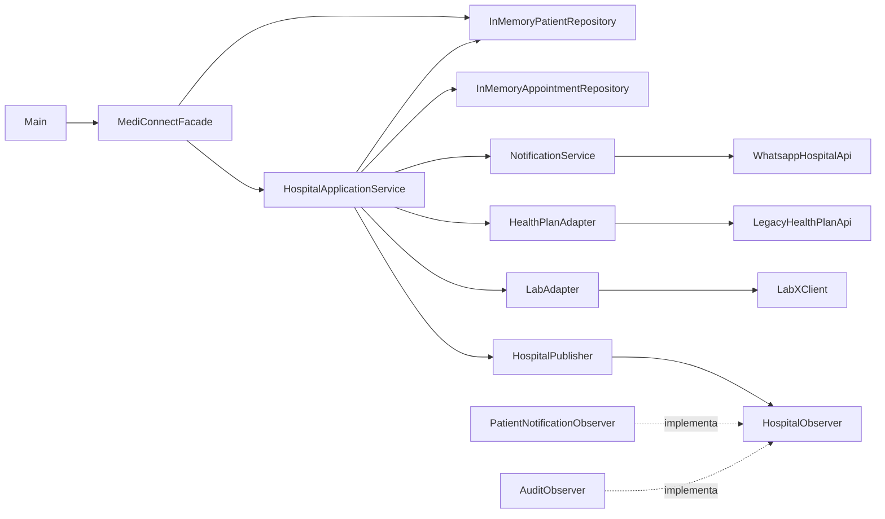

# Aula 05 — Componentes, Conectores, Configuração e Modelagem

## 1. Situação identificada no MediConnect

O MediConnect possui diferentes classes envolvidas nos principais fluxos do sistema.

O `HospitalApplicationService` coordena operações como:

- agendamento de consultas;
- solicitação de exames;
- internações;
- notificações;
- publicação de eventos;
- integração com sistemas externos.

Além disso, existem repositórios, adapters, observadores, serviços e uma fachada que participam desses fluxos.

Com várias classes interagindo entre si, apenas observar o código não deixa totalmente claro quais são os componentes principais do sistema, qual é a responsabilidade de cada um e como eles se relacionam.

Por isso, nesta atividade foi realizada a modelagem da estrutura existente do MediConnect.

A intenção não foi criar novos componentes apenas para atender à atividade, mas documentar a arquitetura que já existe no projeto.

---

## 2. Componentes principais

| Componente | Responsabilidade |
|---|---|
| `Main` | Ponto de entrada utilizado para executar o sistema. |
| `MediConnectFacade` | Fornece uma interface simplificada para acessar funcionalidades do sistema. |
| `HospitalApplicationService` | Coordena os principais casos de uso hospitalares. |
| `InMemoryPatientRepository` | Armazena e recupera pacientes em memória. |
| `InMemoryAppointmentRepository` | Armazena e recupera consultas em memória. |
| `NotificationService` | Centraliza o envio das notificações do sistema. |
| `HealthPlanAdapter` | Adapta a comunicação com o sistema legado do plano de saúde. |
| `LabAdapter` | Adapta a comunicação com o sistema externo do laboratório. |
| `HospitalPublisher` | Publica eventos relacionados às operações hospitalares. |
| `HospitalObserver` | Define o contrato utilizado pelos observadores. |
| `PatientNotificationObserver` | Observa eventos relacionados às notificações dos pacientes. |
| `AuditObserver` | Observa eventos para registro de auditoria. |
| `LegacyHealthPlanApi` | Simula a API legada do plano de saúde. |
| `LabXClient` | Simula o sistema externo do laboratório. |
| `WhatsappHospitalApi` | Simula a integração utilizada para envio de mensagens pelo WhatsApp. |

---

## 3. Conectores e interações

Os componentes se comunicam principalmente por chamadas diretas de métodos Java.

Nas integrações externas, adapters e serviços fazem a ligação entre a aplicação e as classes que simulam sistemas externos.

| Origem | Destino | Interação |
|---|---|---|
| `Main` | `MediConnectFacade` | Criação da fachada e chamadas de seus métodos. |
| `MediConnectFacade` | `InMemoryPatientRepository` | Salva pacientes utilizando `save()`. |
| `MediConnectFacade` | `HospitalApplicationService` | Encaminha operações de consulta e exame. |
| `HospitalApplicationService` | `InMemoryPatientRepository` | Busca pacientes utilizando `find()`. |
| `HospitalApplicationService` | `InMemoryAppointmentRepository` | Salva consultas utilizando `save()`. |
| `HospitalApplicationService` | `NotificationService` | Solicita o envio de notificações. |
| `HospitalApplicationService` | `HealthPlanAdapter` | Solicita autorização de exames. |
| `HealthPlanAdapter` | `LegacyHealthPlanApi` | Adapta a chamada para a API legada. |
| `HospitalApplicationService` | `LabAdapter` | Solicita o envio do exame ao laboratório. |
| `LabAdapter` | `LabXClient` | Adapta a comunicação com o laboratório. |
| `NotificationService` | `WhatsappHospitalApi` | Utiliza a integração para envio de mensagens. |
| `HospitalApplicationService` | `HospitalPublisher` | Publica eventos do sistema. |
| `HospitalPublisher` | `HospitalObserver` | Chama `update()` no observador inscrito. |

---

## 4. Configuração relevante

A configuração principal do projeto está no arquivo:

`pom.xml`

O MediConnect utiliza atualmente:

| Item | Configuração |
|---|---|
| Linguagem | Java |
| Versão de compilação | Java 17 |
| Ferramenta de build | Maven |
| `groupId` | `br.edu.mediconnect` |
| `artifactId` | `mediconnect` |
| Versão do projeto | `0.1.0-LEGADO` |
| Codificação | UTF-8 |
| Testes | JUnit 5 |
| Execução dos testes | Maven Surefire Plugin |
| Persistência | Estruturas em memória |
| Integrações simuladas | Plano de saúde, laboratório e WhatsApp |

A `MediConnectFacade` também participa da configuração dos objetos principais da aplicação, utilizando os repositórios e o serviço responsável pelos principais fluxos hospitalares.

---

## 5. Diagrama de componentes



---

## 6. Leitura do diagrama

O `Main` utiliza a `MediConnectFacade` como ponto de acesso ao sistema.

A fachada mantém os repositórios utilizados pela aplicação e delega os principais fluxos ao `HospitalApplicationService`.

O `HospitalApplicationService` coordena as operações hospitalares e se comunica com:

- repositórios;
- serviço de notificações;
- adapters;
- publisher de eventos.

Os adapters fazem a ligação com sistemas externos, enquanto o `NotificationService` centraliza as notificações.

O `HospitalPublisher` utiliza a interface `HospitalObserver` para comunicar eventos aos observadores.

---

## 7. Relação entre o diagrama e o código

| Elemento | Arquivo |
|---|---|
| `Main` | `src/main/java/br/edu/mediconnect/Main.java` |
| `MediConnectFacade` | `src/main/java/br/edu/mediconnect/patterns/facade/MediConnectFacade.java` |
| `HospitalApplicationService` | `src/main/java/br/edu/mediconnect/service/HospitalApplicationService.java` |
| `InMemoryPatientRepository` | `src/main/java/br/edu/mediconnect/repository/InMemoryPatientRepository.java` |
| `InMemoryAppointmentRepository` | `src/main/java/br/edu/mediconnect/repository/InMemoryAppointmentRepository.java` |
| `NotificationService` | `src/main/java/br/edu/mediconnect/service/NotificationService.java` |
| `HealthPlanAdapter` | `src/main/java/br/edu/mediconnect/patterns/adapter/HealthPlanAdapter.java` |
| `LabAdapter` | `src/main/java/br/edu/mediconnect/patterns/adapter/LabAdapter.java` |
| `HospitalPublisher` | `src/main/java/br/edu/mediconnect/patterns/observer/HospitalPublisher.java` |
| `HospitalObserver` | `src/main/java/br/edu/mediconnect/patterns/observer/HospitalObserver.java` |
| `PatientNotificationObserver` | `src/main/java/br/edu/mediconnect/patterns/observer/PatientNotificationObserver.java` |
| `AuditObserver` | `src/main/java/br/edu/mediconnect/patterns/observer/AuditObserver.java` |
| `LegacyHealthPlanApi` | `src/main/java/br/edu/mediconnect/legacy/LegacyHealthPlanApi.java` |
| `LabXClient` | `src/main/java/br/edu/mediconnect/legacy/LabXClient.java` |
| `WhatsappHospitalApi` | `src/main/java/br/edu/mediconnect/legacy/WhatsappHospitalApi.java` |
| Configuração | `pom.xml` |

---

## 8. Validação

A modelagem representa a estrutura existente no código e não exigiu alteração do comportamento do sistema.

Após os ajustes realizados no projeto, a compilação e os testes automatizados foram verificados com:

```bash
mvn clean test
```

Resultado obtido:

```text
Tests run: 2, Failures: 0, Errors: 0, Skipped: 0
BUILD SUCCESS
```

---

## 9. ADR relacionado

A decisão relacionada à documentação dos componentes, conectores e configurações está registrada em:

`docs/adr/ADR-0003-componentes-conectores-configuracao.md`

---

## Conclusão

A modelagem permite visualizar como o MediConnect está organizado atualmente e como seus principais componentes se relacionam.

A documentação facilita a identificação das dependências existentes e fornece uma visão mais clara da estrutura do sistema para as próximas etapas de evolução do projeto.