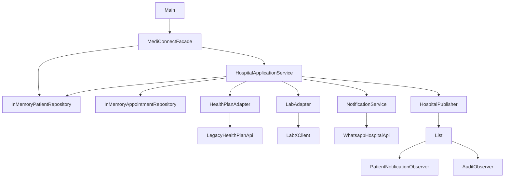

# Aula 07 — Atualização do Diagrama Arquitetural

## Objetivo

Atualizar a representação arquitetural do MediConnect após a decisão registrada no:

`docs/adr/ADR-005-multiplos-observers.md`

Durante a Aula 06 foi identificado que o `HospitalPublisher` armazenava apenas um único `HospitalObserver`.

Com isso, quando dois observers eram inscritos, o segundo substituía o primeiro.

Na Aula 07, o componente foi alterado para permitir o cadastro de múltiplos observers.

---

## Situação anterior

A implementação anterior possuía:

```java
private HospitalObserver observer;
```

O método de inscrição substituía o observer existente:

```java
public void subscribe(HospitalObserver o) {
    observer = o;
}
```

Dessa forma, apesar de existirem as classes:

- `PatientNotificationObserver`;
- `AuditObserver`;

somente o último observer cadastrado permanecia ativo.

---

## Decisão aplicada

O `HospitalPublisher` passou a utilizar uma coleção:

```java
private final List<HospitalObserver> observers = new ArrayList<>();
```

O método de inscrição passou a adicionar observers:

```java
public void subscribe(HospitalObserver observer) {
    observers.add(observer);
}
```

E o método de publicação passou a percorrer todos os elementos cadastrados:

```java
public void publish(String entityId, String event) {
    for (HospitalObserver observer : observers) {
        observer.update(entityId, event);
    }
}
```

---

## Diagrama arquitetural atualizado



---

## Alteração arquitetural observada

A alteração não modifica o estilo arquitetural principal do MediConnect.

O sistema continua utilizando uma arquitetura em camadas simples.

A mudança ocorre especificamente no mecanismo interno de publicação de eventos.

### Antes

```text
HospitalPublisher
       ↓
HospitalObserver
       ↓
apenas um observer armazenado
```

### Depois

```text
HospitalPublisher
       ↓
List<HospitalObserver>
       │
       ├── PatientNotificationObserver
       │
       └── AuditObserver
```

Agora vários componentes interessados podem receber o mesmo evento sem que uma nova inscrição substitua as anteriores.

---

## Relação com o requisito

A alteração está relacionada principalmente ao:

**RNF03 — Confiabilidade/Disponibilidade.**

A decisão melhora a confiabilidade do mecanismo interno de eventos porque todos os observers cadastrados podem receber as atualizações esperadas.

---

## Validação

Foi criado o teste automatizado:

`src/test/java/br/edu/mediconnect/patterns/observer/HospitalPublisherTest.java`

O teste:

1. cria um `HospitalPublisher`;
2. cadastra dois observers;
3. publica um evento;
4. verifica se os dois observers receberam a atualização.

A validação foi realizada através do comando:

```bash
mvn clean test
```

Resultado:

```text
Tests run: 3, Failures: 0, Errors: 0, Skipped: 0
BUILD SUCCESS
```

Durante a execução também foi possível observar:

```text
PATIENT ALERT A1 SCHEDULED
AUDIT A1 SCHEDULED
```

confirmando que os dois observers recebem o evento.

---

## Rastreabilidade

A alteração pode ser rastreada através dos seguintes artefatos:

- **Requisito:** RNF03 — Confiabilidade/Disponibilidade.
- **Problema identificado:** `docs/Entrega_Aula6/README-Aula06.md`.
- **Decisão:** `docs/adr/ADR-005-multiplos-observers.md`.
- **Implementação:** `src/main/java/br/edu/mediconnect/patterns/observer/HospitalPublisher.java`.
- **Teste:** `src/test/java/br/edu/mediconnect/patterns/observer/HospitalPublisherTest.java`.
- **Matriz:** `docs/aula07-rastreabilidade.md`.

---

## Conclusão

A atualização do `HospitalPublisher` resolveu o problema identificado na análise arquitetural anterior sem exigir alteração completa da arquitetura do MediConnect.

A solução mantém o padrão Observer utilizado pelo projeto, permite múltiplos interessados e possui teste automatizado comprovando o comportamento implementado.