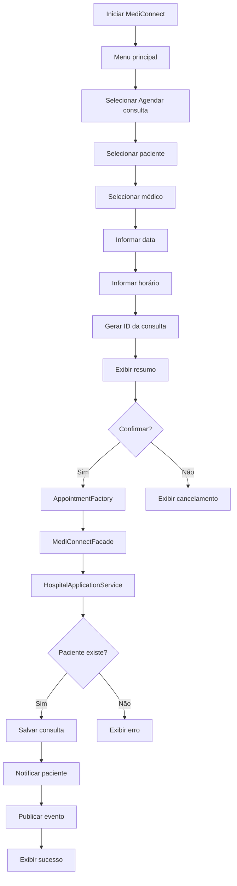
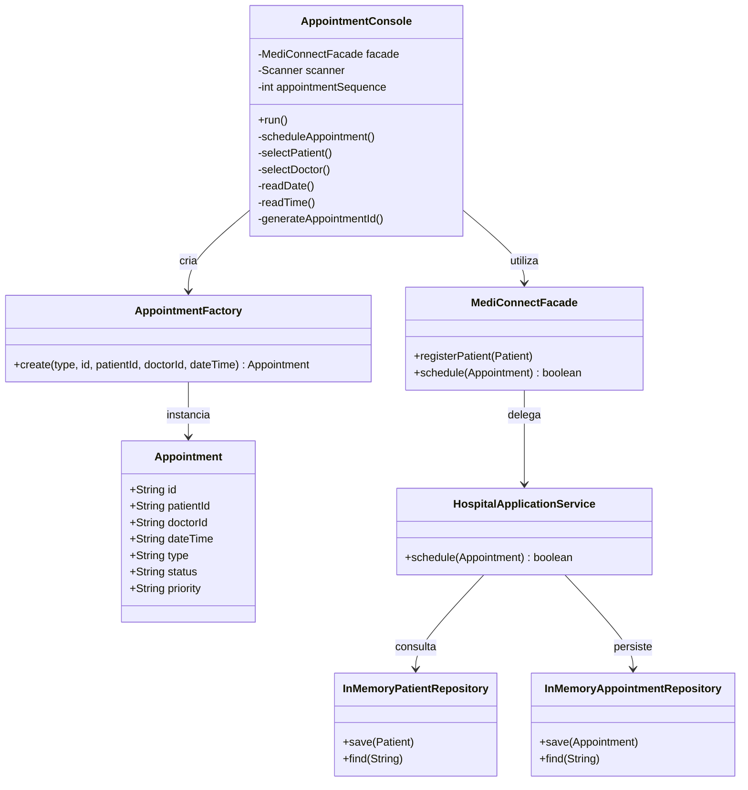
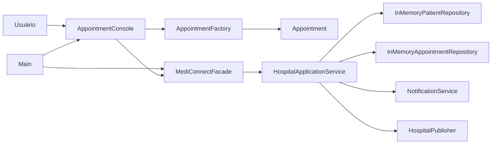
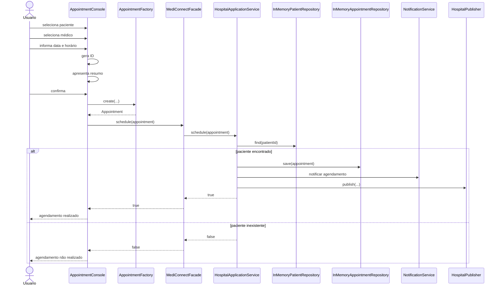

# Aula 08 — Fatia Vertical: Agendamento de Consulta

## 1. Requisito selecionado

Para a atividade foi selecionado o requisito:

**RF01 — O sistema deve permitir marcar consultas.**

Esse requisito já fazia parte dos requisitos iniciais do MediConnect e já possuía parte da lógica implementada através do método `schedule(...)` da `HospitalApplicationService`.

Nesta atividade, o objetivo foi evoluir esse requisito para uma fatia vertical completa, conectando a experiência do usuário com a arquitetura e o código existente.

---

## 2. Problema / necessidade identificada

Antes desta atividade, o MediConnect já possuía as classes necessárias para realizar o agendamento de uma consulta.

O sistema já conseguia:

- localizar o paciente;
- alterar o status da consulta para `SCHEDULED`;
- armazenar a consulta no repositório;
- enviar notificações;
- publicar o evento de agendamento.

Entretanto, a execução existente em `Main.java` utilizava dados definidos diretamente no código.

Exemplo:

```java
Appointment a = AppointmentFactory.create(
        "CONSULTATION",
        "A1",
        "P1",
        "D1",
        "2026-08-20T19:00"
);
```

Dessa forma, a funcionalidade existia tecnicamente, mas não havia uma interface simples para que uma pessoa pudesse realizar o agendamento.

Além disso, para testar o sistema era necessário conhecer previamente identificadores internos como:

```text
P1
D1
A1
```

Isso tornava o fluxo pouco intuitivo para alguém que não conhecesse a implementação do MediConnect.

---

## 3. Objetivo da evolução

A evolução realizada na Aula 08 foi criar uma interface simples de console para permitir que o agendamento fosse utilizado de forma interativa.

A solução deveria:

1. apresentar uma opção de agendamento;
2. mostrar o paciente disponível para teste;
3. permitir selecionar o paciente;
4. apresentar uma opção de médico;
5. permitir selecionar o médico;
6. solicitar a data;
7. solicitar o horário;
8. gerar automaticamente o identificador da consulta;
9. apresentar um resumo antes da confirmação;
10. enviar a consulta para o fluxo já existente;
11. apresentar o resultado da operação.

A interface não deveria duplicar as regras de negócio da aplicação.

---

## 4. Jornada do usuário

### Ator

Usuário responsável pelo agendamento de consultas.

### Pré-condição

Para a demonstração da fatia vertical, o sistema inicia com o paciente:

```text
Ana — P1
```

cadastrado na `MediConnectFacade`.

A interface também apresenta um médico de demonstração para permitir a execução do fluxo completo.

### Fluxo principal

1. O usuário inicia o MediConnect.
2. O sistema apresenta o menu principal.
3. O usuário escolhe a opção `Agendar consulta`.
4. O sistema apresenta o paciente disponível.
5. O usuário seleciona o paciente.
6. O sistema apresenta o médico disponível.
7. O usuário seleciona o médico.
8. O sistema solicita a data da consulta.
9. O usuário informa a data.
10. O sistema solicita o horário.
11. O usuário informa o horário.
12. O sistema gera automaticamente o identificador da consulta.
13. O sistema apresenta um resumo dos dados.
14. O usuário confirma o agendamento.
15. A interface cria a consulta utilizando a `AppointmentFactory`.
16. A consulta é enviada para a `MediConnectFacade`.
17. A fachada delega o fluxo para a `HospitalApplicationService`.
18. O serviço verifica se o paciente existe.
19. A consulta é armazenada no repositório.
20. O status da consulta passa para `SCHEDULED`.
21. As notificações e os eventos relacionados ao agendamento são executados.
22. O sistema apresenta a confirmação para o usuário.

---

## 5. Fluxos alternativos

### Opção inválida

Caso o usuário informe uma opção que não exista no menu, o sistema apresenta uma mensagem de erro e permite uma nova tentativa.

### Paciente inválido

Caso seja informada uma opção de paciente que não exista, a interface solicita uma nova escolha.

### Médico inválido

Caso seja informada uma opção de médico que não exista, a interface solicita uma nova escolha.

### Data inválida

A data deve seguir o formato:

```text
DD/MM/AAAA
```

Caso o formato seja inválido, o sistema informa o problema e solicita a data novamente.

### Horário inválido

O horário deve seguir o formato:

```text
HH:MM
```

Caso seja inválido, o sistema solicita uma nova entrada.

### Cancelamento

Antes de concluir o agendamento, o sistema apresenta um resumo.

O usuário pode informar:

```text
S
```

para confirmar ou:

```text
N
```

para cancelar.

---

## 6. Fluxo simplificado



---

## 7. Wireframe da interface funcional

A implementação mínima da fatia vertical utiliza uma interface de console.

### Tela inicial

```text
========================================
              MEDICONNECT
========================================

1 - Agendar consulta
0 - Sair

Escolha uma opção: _
```

### Seleção do paciente

```text
========================================
       AGENDAMENTO DE CONSULTA
========================================

Pacientes disponíveis:

1 - Ana (P1)
0 - Voltar

Escolha o paciente: _
```

### Seleção do médico

```text
Médicos disponíveis:

1 - Médico D1
0 - Voltar

Escolha o médico: _
```

### Data e horário

```text
Data da consulta (DD/MM/AAAA): __/__/____

Horário da consulta (HH:MM): __:__
```

### Resumo do agendamento

```text
========================================
        RESUMO DO AGENDAMENTO
========================================

Consulta: A1
Paciente: Ana
Médico: Médico D1
Data: 20/09/2026
Horário: 10:00

Confirmar agendamento? (S/N): _
```

### Resultado

```text
========================================
       AGENDAMENTO REALIZADO
========================================

Consulta: A1
Paciente: Ana
Médico: Médico D1
Data: 20/09/2026
Horário: 10:00
Status: SCHEDULED

Consulta agendada com sucesso.
```

---

## 8. Protótipo visual

Além do wireframe da interface funcional, foi produzido um protótipo visual simples para demonstrar como o mesmo fluxo poderia ser apresentado em uma interface gráfica.

O arquivo está disponível em:

`docs/anexos/aula08-prototipo-mediconnect.png`

O protótipo apresenta quatro etapas principais:

1. tela inicial;
2. seleção do paciente;
3. seleção do médico, data e horário;
4. confirmação do agendamento.

O protótipo é apenas uma representação visual da possível evolução da interface.

Ele não representa uma interface gráfica já implementada no código.

A implementação funcional utilizada nesta atividade continua sendo a interface de console.

---

## 9. Modelo da fatia vertical



---

## 10. Responsabilidade dos principais elementos

| Elemento | Responsabilidade |
|---|---|
| `Main` | Inicializar a aplicação, cadastrar o paciente de demonstração e iniciar a interface. |
| `AppointmentConsole` | Realizar a interação com o usuário. |
| `AppointmentFactory` | Criar a instância de `Appointment`. |
| `Appointment` | Representar a consulta. |
| `MediConnectFacade` | Fornecer um ponto simplificado de acesso ao sistema. |
| `HospitalApplicationService` | Coordenar o fluxo e aplicar as regras de agendamento. |
| `InMemoryPatientRepository` | Armazenar e localizar pacientes. |
| `InMemoryAppointmentRepository` | Armazenar e localizar consultas. |
| `NotificationService` | Executar as notificações relacionadas ao agendamento. |
| `HospitalPublisher` | Publicar o evento para os observers cadastrados. |

---

## 11. Componente arquitetural

A nova interface foi adicionada como componente de entrada da aplicação.

O componente:

```text
AppointmentConsole
```

não acessa diretamente:

- os repositórios;
- o serviço de notificações;
- o publisher;
- as regras internas da aplicação.

Sua principal dependência é:

```text
AppointmentConsole
        ↓
MediConnectFacade
        ↓
HospitalApplicationService
```

Isso permite reutilizar a arquitetura já existente sem duplicar as regras do sistema.

---

## 12. Diagrama arquitetural da fatia



---

## 13. Diagrama de sequência



---

## 14. Implementação realizada

Foi criada a classe:

```text
src/main/java/br/edu/mediconnect/ui/AppointmentConsole.java
```

Ela é responsável pela interface funcional desta fatia vertical.

Também foi atualizado:

```text
src/main/java/br/edu/mediconnect/Main.java
```

O `Main`:

1. cria a `MediConnectFacade`;
2. cadastra o paciente utilizado na demonstração;
3. cria a `AppointmentConsole`;
4. inicia a interface.

---

## 15. Evolução da experiência de uso

A primeira versão da interface solicitava diretamente:

```text
ID da consulta
ID do paciente
ID do médico
```

Apesar de funcionar tecnicamente, isso exigia que o usuário conhecesse identificadores internos do sistema.

Por isso, a interface foi evoluída.

Na versão final:

- o ID da consulta é gerado automaticamente;
- o paciente é escolhido através de uma opção apresentada pelo sistema;
- o médico é escolhido através de uma opção apresentada pelo sistema;
- data e horário possuem formatos definidos;
- entradas inválidas são tratadas;
- existe um resumo antes da confirmação;
- o usuário pode cancelar o agendamento;
- o resultado é apresentado de maneira legível.

Essa mudança melhora a experiência de uso sem transferir regras de negócio para a interface.

---

## 16. Funcionalidade executável

A aplicação pode ser executada após a compilação utilizando:

```bash
java -cp target\classes br.edu.mediconnect.Main
```

O usuário consegue realizar o fluxo:

```text
Menu
 ↓
Selecionar paciente
 ↓
Selecionar médico
 ↓
Informar data
 ↓
Informar horário
 ↓
Visualizar resumo
 ↓
Confirmar
 ↓
Agendamento
 ↓
Resultado
```

A funcionalidade foi executada manualmente durante a atividade e o agendamento foi concluído corretamente.

---

## 17. Validação técnica

Após as alterações, o projeto foi validado através do Maven:

```bash
mvn clean test
```

Os testes automatizados continuaram passando após a inclusão da nova interface.

Resultado da validação:

```text
Tests run: 3, Failures: 0, Errors: 0, Skipped: 0
BUILD SUCCESS
```

Também foi realizada a execução manual da aplicação através de:

```bash
java -cp target\classes br.edu.mediconnect.Main
```

O fluxo completo de agendamento foi executado com sucesso.

---

## 18. Rastreabilidade da fatia vertical

| Etapa | Elemento | Evidência |
|---|---|---|
| Requisito | RF01 — marcar consultas | `docs/requisitos_iniciais.md` |
| Jornada | Fluxo de agendamento | `docs/aula08-fatia-vertical.md` |
| Wireframe | Interface de console | `docs/aula08-fatia-vertical.md` |
| Protótipo | Protótipo visual | `docs/anexos/aula08-prototipo-mediconnect.png` |
| Interface | `AppointmentConsole` | `src/main/java/br/edu/mediconnect/ui/AppointmentConsole.java` |
| Modelo | `Appointment` | `src/main/java/br/edu/mediconnect/model/Appointment.java` |
| Criação | `AppointmentFactory` | `src/main/java/br/edu/mediconnect/patterns/factory/AppointmentFactory.java` |
| Entrada arquitetural | `MediConnectFacade` | `src/main/java/br/edu/mediconnect/patterns/facade/MediConnectFacade.java` |
| Regra de aplicação | `HospitalApplicationService` | `src/main/java/br/edu/mediconnect/service/HospitalApplicationService.java` |
| Persistência | `InMemoryAppointmentRepository` | `src/main/java/br/edu/mediconnect/repository/InMemoryAppointmentRepository.java` |
| Notificação | `NotificationService` | `src/main/java/br/edu/mediconnect/service/NotificationService.java` |
| Eventos | `HospitalPublisher` | `src/main/java/br/edu/mediconnect/patterns/observer/HospitalPublisher.java` |
| Validação | Maven + execução manual | `mvn clean test` |

---

## 19. Fluxo de rastreabilidade

```text
RF01 — Marcar consultas
        ↓
Jornada do usuário
        ↓
Wireframe
        ↓
Protótipo visual
        ↓
AppointmentConsole
        ↓
AppointmentFactory
        ↓
Appointment
        ↓
MediConnectFacade
        ↓
HospitalApplicationService
        ↓
Repositories
        ↓
NotificationService
        ↓
HospitalPublisher
        ↓
Testes e execução manual
        ↓
BUILD SUCCESS
```

---

## 20. Limites da fatia vertical

A atividade implementa apenas uma funcionalidade completa do MediConnect.

Não fazem parte desta fatia:

- cadastro interativo de pacientes;
- cadastro real de médicos;
- gerenciamento de agenda médica;
- consulta real de horários disponíveis;
- cancelamento de consultas já cadastradas;
- alteração de consultas;
- persistência em banco de dados;
- autenticação;
- interface gráfica funcional completa.

Esses pontos podem ser tratados em evoluções futuras.

---

## 21. Conclusão

A Aula 08 evoluiu o requisito RF01 de uma funcionalidade que existia principalmente no código para uma fatia vertical utilizável e executável.

O fluxo passou a possuir:

- jornada de usuário;
- wireframe;
- protótipo visual;
- interface funcional;
- modelo;
- componente arquitetural;
- integração com a lógica existente;
- rastreabilidade;
- validação através de testes e execução manual.

A implementação reutiliza os componentes já existentes no MediConnect e mantém a separação de responsabilidades entre interface, fachada, serviço, persistência, notificações e eventos.

O protótipo visual representa uma possível evolução futura da experiência do usuário, enquanto a interface de console demonstra atualmente o funcionamento completo da fatia vertical.