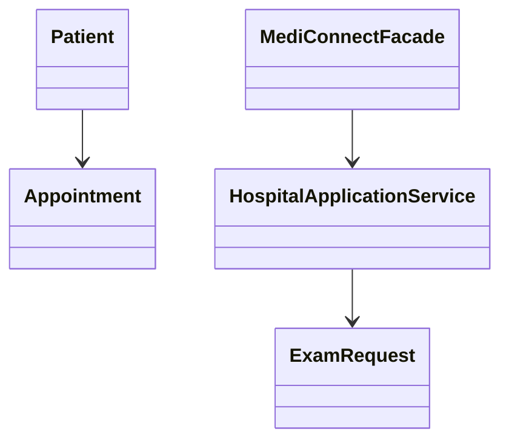

# Diagrama legado

```mermaid
classDiagram
 Patient --> Appointment
 MediConnectFacade --> HospitalApplicationService
 HospitalApplicationService --> ExamRequest
```
O diagrama não acompanha todas as alterações do código.
